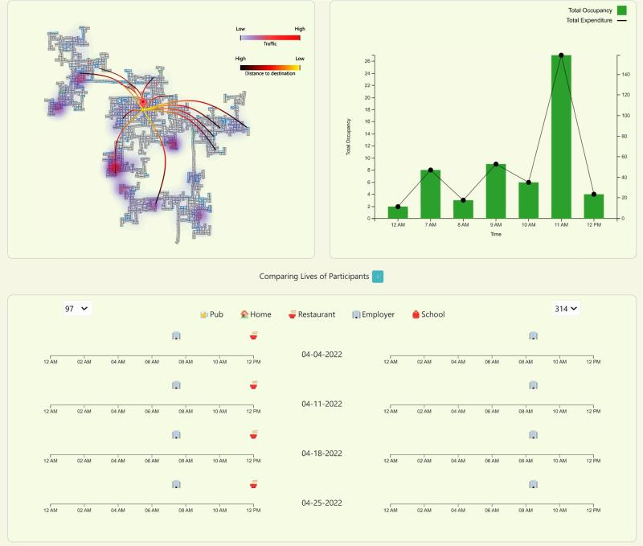

# Dashboard




## 1. Install npm and Node.js

To install npm and Node.js, follow the instructions provided in the [official npm documentation](https://docs.npmjs.com/downloading-and-installing-node-js-and-npm).

## 2. Install Node dependencies

To install npm and the correct version of Node.js specified in the package.json file, follow these steps:

1. Open your terminal or command prompt.
2. Navigate to the root directory of your project.
3. Run the following command to install npm:

   ```shell
   npm install
   ```

   This will install npm and all the dependencies specified in the package.json file.

## 2. Install SQLite3

```shell
brew install sqlite3
```

## 3. Symlink the dataset folder

To symlink the actual dataset folder to the Datasets folder in the root directory, follow these steps:

1. Open your terminal or command prompt.
2. Navigate to the root directory of your project.
3. Run the following command to create a symlink:

   ```shell
   ln -s /path/to/actual/dataset Datasets
   ```

   Replace `/path/to/actual/dataset` with the actual path to your dataset folder.

## 4. Initialize the database

To initialize the database, follow these steps:

1. Open your terminal or command prompt.
2. Navigate to the root directory of your project.
3. Create an empty directory named `db`.
4. Run the following command to open the SQLite3 shell and run the following command to read and execute the `initdb` script:

   ```shell
   sqlite3 db/vast.2022.mc2 '.read initdb'
   ```

This will initialize the database with the necessary tables and data.

That's it! You have successfully installed npm, the correct version of Node.js, SQLite3, symlinked the dataset folder, and initialized the database. You are now ready to start working with your project.
